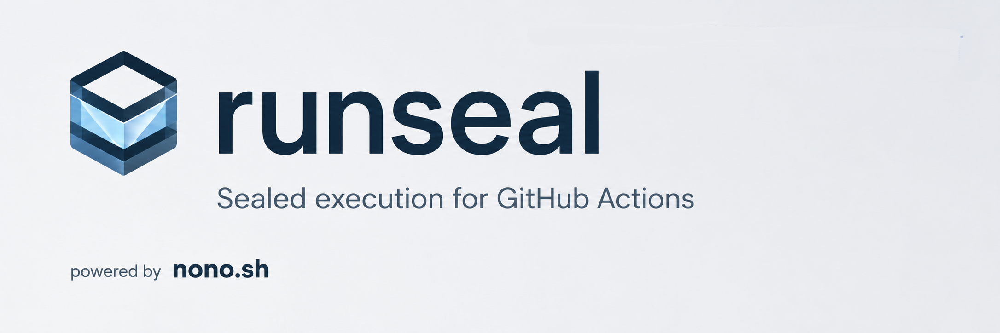

<div align="center">

<picture>
  <source media="(prefers-color-scheme: dark)" srcset="./assets/banner-dark.png">
  
</picture>

  <a href="https://discord.gg/pPcjYzGvbS">
    
  </a>
   <a href="https://alwaysfurther.ai/careers">
      
  </a>
</p>
</div>

Runseal was built to solve the problem of software supply chain attacks that are often triggered from GitHub Actions-based exploits.

We built runseal in response to the rise of supply chain attacks targeting GitHub Actions, where attackers often gain access to repository secrets and use them to exfiltrate data or deploy malicious code. By using [nono's](https://github.com/always-further/nono) kernel-enforced sandboxing, runseal can protect sensitive files, secrets/tokens, and filter network access from untrusted or malicious code, while still allowing necessary software engineering operations through a flexible policy system.

From the same folks who brought you [sigstore](https://sigstore.dev) and [nono](https://nono.sh).

> [!WARNING]
> **Early Alpha Software**
> This project is in early alpha and under active development. Expect bugs, breaking changes, and incomplete features and a series of follow-up security audits. Therefore consider this an early preview until this note is updated.

## What Runseal Does

- Replace real secrets within a workflow with session scoped phantom credentials that are useless if ever leaked
- Protects sensitive files and secrets from exfiltration by untrusted code in CI using Landlock's kernel-enforced sandboxing via nono.
- L7 network filtering to lock down network access by HTTP method and path
- Blocks network by default unless policy explicitly allows a host or credential route
- Cryptographic audit captured outside of the sandbox for all network requests, credential injections, and filesystem access

## Quick Start

```yaml
name: Publish

on:
  workflow_dispatch:

jobs:
  publish:
    runs-on: ubuntu-latest
    steps:
      - uses: actions/checkout@v4

      - uses: always-further/runseal@v0.3.3
        with:
          run: npm publish
          policy: |
            fs:
              read: ["."]
              write: []
            network:
              mode: filtered
            access:
              npm:
                secret: NPM_TOKEN
                url: https://registry.npmjs.org
                allow:
                  - PUT /**
        env:
          NPM_TOKEN: ${{ secrets.NPM_TOKEN }}
```

In this example, `npm publish` can read the repository, cannot write to paths
not listed in `fs.write`, network access is limited to 'registry.npmjs.org' with no access to other hosts, and 'NPM_TOKEN' is retrieved from GitHub Secrets and a phantom credential is injected in its place. If the workflow is compromised and an attacker tries to exfiltrate the token or publish a malicious package, the attack would be blocked by the sandbox and the real token would remain safe and outside of the 'npm publish 'workflow. 

## Policy Format

Runseal policy is YAML passed through the `policy` input.

```yaml
fs:
  read:
    - "."
    - "$HOME/.cache/my-tool"
  write:
    - "./dist"

network:
  mode: filtered
  allow:
    - api.github.com

access:
  deploy:
    secret: DEPLOY_TOKEN
    url: https://api.example.com
    allow:
      - POST /v1/deployments
      - GET /v1/deployments/*
```

### Filesystem Access

`fs.read` lists paths the command can read. `fs.write` lists paths the command
can write.

Keep these narrow. For example, a deploy step often only needs to read `./dist`
and a config file, and may not need write access at all.

```yaml
fs:
  read: ["./dist", "./fly.toml"]
  write: []
```

### Network Access

Runseal expects `network.mode: blocked` or `network.mode: filtered`.

Add `network.allow` only for unauthenticated hosts the command must reach. Hosts
used by access grants are added to the generated `nono` profile automatically.

```yaml
network:
  mode: filtered
  allow:
    - api.github.com
```

### Access Grants

Each key under `access` is a named grant. `secret` is the environment variable
containing the real secret, `url` is the service base URL, and `allow` lists the
HTTP routes where the secret may be injected. Runseal masks the secret in logs,
writes it to a private file, removes it from the child environment, and
configures `nono` to inject it through the local proxy.

```yaml
access:
  fly:
    secret: FLY_API_TOKEN
    url: https://api.machines.dev
    allow:
      - POST /v1/apps/*/machines
```

The sandboxed command receives a phantom credential for SDK compatibility. The
real secret remains outside the sandbox and is only inserted by the proxy when
the host and endpoint policy match.

### HTTPS Endpoint Filtering

`allow` restricts access use by HTTP method and path. Matching is allow-list
based.

```yaml
allow:
  - POST /v1/apps/*/releases
  - GET /v1/apps/*/status
```

Runseal relies on `nono` TLS interception for this. The `nono` proxy creates an
ephemeral trust bundle and injects standard CA environment variables into the
sandboxed process, so common HTTPS clients can connect through the proxy while
still allowing L7 policy enforcement.

## Common Recipes

### Run Tests With No Network

```yaml
- uses: always-further/runseal@v0.3.2
  with:
    run: npm test
    policy: |
      fs:
        read: [".", "./node_modules"]
        write: ["./coverage"]
      network:
        mode: blocked
```

### Build With Package Registry Access

```yaml
- uses: always-further/runseal@v0.3.2
  with:
    run: npm ci
    policy: |
      fs:
        read: ["."]
        write: ["./node_modules"]
      network:
        mode: filtered
        allow:
          - registry.npmjs.org
```

### Deploy With A Sealed Token

```yaml
- uses: always-further/runseal@v0.3.2
  with:
    run: ./scripts/deploy.sh
    policy: |
      fs:
        read: ["./dist", "./deploy.yaml"]
        write: []
      network:
        mode: filtered
      access:
        deploy:
          secret: DEPLOY_TOKEN
          url: https://deploy.example.com
          allow:
            - POST /v1/releases
            - GET /v1/releases/*
  env:
    DEPLOY_TOKEN: ${{ secrets.DEPLOY_TOKEN }}
```

## Inputs

| Input | Required | Default | Description |
| --- | --- | --- | --- |
| `run` | Yes | none | Command to execute inside the sandbox. |
| `policy` | No | empty | Runseal policy YAML. Prefer this for new workflows. |
| `fs-read` | No | empty | Comma-separated read paths when `policy` is not set. |
| `fs-write` | No | empty | Comma-separated write paths when `policy` is not set. |
| `network` | No | `blocked` | Network policy when `policy` is not set: `blocked` or comma-separated domains. |
| `runseal-version` | No | `0.3.1` | Runseal release version to install. Accepts `v0.1.0` or `0.1.0`. |
| `nono-version` | No | `0.62.0` | nono release version to install. Accepts `v0.1.0` or `0.1.0`. |
| `verify-attestations` | No | `true` | Verify GitHub artifact attestations for downloaded release assets. |
| `audit` | No | `false` | Set to `artifact` or `true` to upload nono audit evidence as a GitHub Actions artifact. |

## Audit Evidence

Runseal can export the nono audit session for a sandboxed command:

```yaml
- uses: always-further/runseal@v0.3.2
  with:
    run: npm rebuild
    audit: artifact
    policy: |
      fs:
        read: [".", "./node_modules"]
        write: ["./node_modules"]
      network:
        mode: blocked
```

When enabled, Runseal captures the new nono audit session after the command
finishes and uploads a `runseal-audit` artifact containing:

- `summary.md`
- one JSON file per detected nono audit session

Audit export runs before Runseal returns the sandboxed command's exit status, so
failed or denied commands can still produce audit evidence.

## Requirements

- Linux x86_64 GitHub-hosted runner
- `gh` CLI available on the runner for attestation verification
- Published release assets for both Runseal and `nono`

Release assets are expected to use this naming scheme:

- `runseal-v<version>-x86_64-unknown-linux-gnu.tar.gz`
- `nono-v<version>-x86_64-unknown-linux-gnu.tar.gz`
- `SHA256SUMS`

## Development

```bash
make ci
```

`make ci` runs `make lint` and `make test` — the same Rust checks as the [CI workflow](.github/workflows/ci.yml).

```bash
make lint       # clippy + fmt check
make test       # unit tests only
make fmt        # format code
make audit      # cargo audit (run make audit-install first)
```
